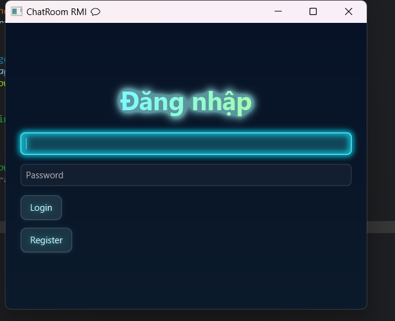
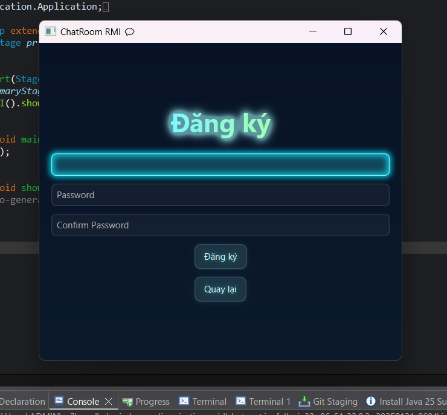
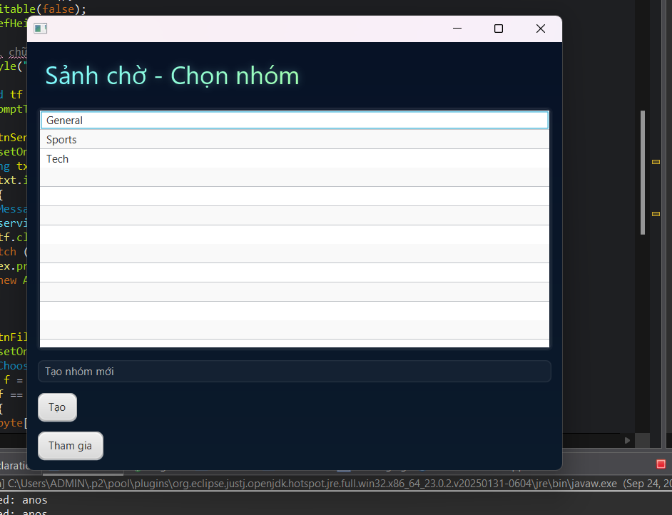
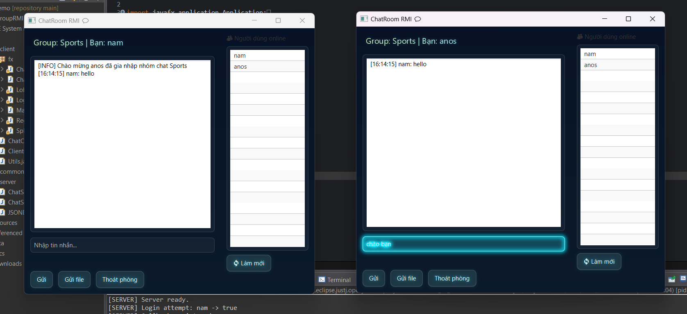

<h2 align="center">
    <a href="https://dainam.edu.vn/vi/khoa-cong-nghe-thong-tin">
    🎓 Faculty of Information Technology (DaiNam University)
    </a>
</h2>
<h2 align="center">
  Hệ thống Chat Nhóm bằng RMI +JavaFX
</h2>
<div align="center">
    <p align="center">
        
        
        
    </p>

[](https://www.facebook.com/DNUAIoTLab)
[](https://dainam.edu.vn/vi/khoa-cong-nghe-thong-tin)
[](https://dainam.edu.vn)

</div>


## 1. 📖 Giới thiệu hệ thống
Hệ thống **Chat Nhóm bằng RMI** được xây dựng để phục vụ trao đổi, thảo luận nhóm trong môi trường LAN/lab.  
Mục tiêu là minh họa cách xây dựng ứng dụng phân tán bằng **Java RMI**, kèm giao diện **JavaFX** và lưu lịch sử tin nhắn lên **DB**.

**Các chức năng chính**

**Người dùng:**
- 📝 Đăng ký / Đăng nhập
- 🏷️ Xem danh sách nhóm (Lobby)
- 💬 Tham gia nhóm, gửi & nhận tin nhắn thời gian thực
- 📜 Xem lại lịch sử tin nhắn

**Quản trị viên:**
- 👥 Quản lý user (tạo/xoá/khóa)
- 🗂️ Quản lý nhóm (tạo/xoá/assign)
- 📊 Thống kê cơ bản (user online, số message...)


## 2. 🛠️ Ngôn ngữ & Công nghệ chính
- ☕ **Java (JDK 11+)**  
- 🔗 **Java RMI** (Remote Method Invocation)  
- 🎨 **JavaFX (FXML)** — giao diện client  
- 🗄️ **MySQL** (hoặc SQLite cho dev nhẹ) — lưu user/group/message  
- 📦 **Maven / Gradle** — build & quản lý dependency  
- 💻 IDE: **Eclipse / IntelliJ IDEA**  
- 🌐 Dev environment: Windows / Linux (local LAN)

**Môi trường chạy (ví dụ):**
- JDK 11+, Maven, MySQL, Port RMI: `1099`.


## 3. 🖼️ Hình ảnh các chức năng

- 🔑 **Login / Register**  
  ```markdown

---


  🏠 Lobby (Sảnh chờ)


💬 Chat Window (Phòng chat)



## 4.📝 Các bước cài đặt
<pre>
Bước 1: Chuẩn bị môi trường

Kiểm tra Java:
Mở terminal/command prompt và chạy:

java -version
javac -version
---

→ Đảm bảo cả hai lệnh đều hiển thị Java 8 trở lên.

Chuẩn bị IDE:
Khuyến nghị sử dụng Eclipse IDE hoặc IntelliJ IDEA.
Khi mở IDE, chọn workspace là thư mục project RMI Chat.
</pre>
---
<pre>
Bước 2: Tạo Project và Cấu trúc

Tạo một Java Project mới trong Eclipse:

File → New → Java Project
Project name: RMIChatGroup
JRE: Sử dụng default JRE (Java 8/11/17)
Bỏ chọn “Create module-info.java”
→ Finish
Tạo các package chính:
ChatRMIProject/
│
├── src/
│   ├── common/                     # Chứa interface và class chung cho client + server
│   │   ├── ChatService.java        # Interface RMI
│   │   ├── ClientCallback.java     # Interface callback từ server -> client
│   │   └── Message.java            # Class tin nhắn (text/file)
│   │
│   ├── server/                     # Server side
│   │   ├── ChatServiceImpl.java    # Cài đặt ChatService
│   │   └── ChatServerMain.java     # Chạy server RMI
│   │
│   ├── client/                     # Client side
│   │   ├── ClientCallbackImpl.java # Triển khai callback
│   │   ├── ChatClientApp.java      # Main test login/register không UI
│   │   │
│   │   └── fx/                     # Các UI JavaFX
│   │       ├── MainApp.java        # Entry point JavaFX
│   │       ├── WelcomeUI.java      # Giao diện mở đầu
│   │       ├── LoginUI.java        # Giao diện đăng nhập
│   │       ├── RegisterUI.java     # Giao diện đăng ký
│   │       ├── LobbyUI.java        # Giao diện sảnh chờ (3 nhóm mặc định)
│   │       └── ChatRoomUI.java     # Giao diện nhóm chat
│   │
│   └── database/                   # Database tạm thời bằng JSON
│       └── JsonDatabase.java       # Quản lý đọc/ghi file JSON (users, groups)
│
└── resources/
    ├── neon.css                    # CSS giao diện neon nhẹ nhàng
    └── users.json                  # DB user tạm (tự tạo khi đăng ký nếu chưa có)

</pre>

---
<pre>
Bước 3: Thêm mã nguồn

Copy toàn bộ source code vào đúng package/file tương ứng.

Nhấn Ctrl + Shift + O (Eclipse) để organize imports.

Đảm bảo không có lỗi compile trong Project Explorer.
</pre>
---
<pre>
Bước 4: Chạy ứng dụng

Khởi động Server:

Mở file ServerMain.java trong package server.

Chạy:

Run As → Java Application


Console hiển thị:

RMI Chat Server started...
Đang chờ client kết nối...


Khởi động Client:

Mở file MainApp.java trong package client.

Chạy:

Run As → Java Application


Giao diện đăng nhập xuất hiện.

Sau khi đăng nhập thành công:

Màn hình Welcome hiển thị thông điệp chào mừng.

Chuyển đến Lobby (chọn phòng chat).

Vào ChatRoom để trao đổi tin nhắn nhóm.

Khi client kết nối thành công, console server sẽ log:

Client đã kết nối: /127.0.0.1
</pre>

## 5. Liên hệ cá nhân
<pre>
Sinh viên thực hiện: Trịnh Hữu Hiệu
Khoa công nghệ thông tin – Đại học Đại Nam
🌐 Website: https://dainam.edu.vn/vi/khoa-cong-nghe-thong-tin
📧 Email: [trinhhuuhieu19122003@gmail.com]
📱 Fanpage: AIoTLab - FIT DNU
</pre>
