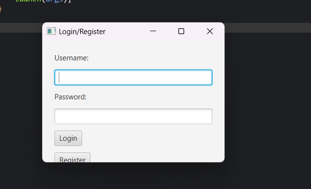
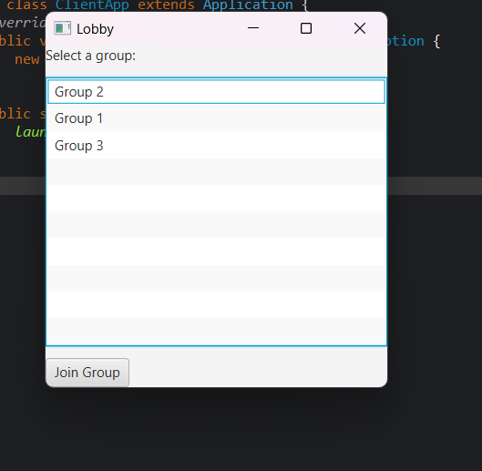
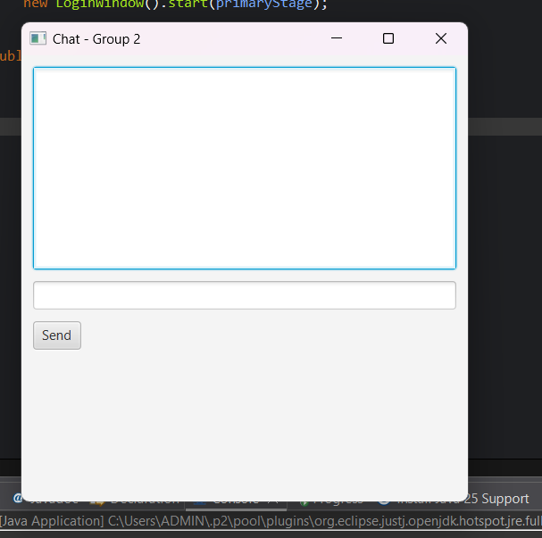

<h2 align="center">
    <a href="https://dainam.edu.vn/vi/khoa-cong-nghe-thong-tin">
    🎓 Faculty of Information Technology (DaiNam University)
    </a>
</h2>
<h2 align="center">
  Hệ thống Chat Nhóm bằng RMI +JavaFX
</h2>
<div align="center">
    <p align="center">
        
        
        
    </p>

[](https://www.facebook.com/DNUAIoTLab)
[](https://dainam.edu.vn/vi/khoa-cong-nghe-thong-tin)
[](https://dainam.edu.vn)

</div>


## 1. 📖 Giới thiệu hệ thống
Hệ thống **Chat Nhóm bằng RMI** được xây dựng để phục vụ trao đổi, thảo luận nhóm trong môi trường LAN/lab.  
Mục tiêu là minh họa cách xây dựng ứng dụng phân tán bằng **Java RMI**, kèm giao diện **JavaFX** và lưu lịch sử tin nhắn lên **DB**.

**Các chức năng chính**

**Người dùng:**
- 📝 Đăng ký / Đăng nhập
- 🏷️ Xem danh sách nhóm (Lobby)
- 💬 Tham gia nhóm, gửi & nhận tin nhắn thời gian thực
- 📜 Xem lại lịch sử tin nhắn

**Quản trị viên:**
- 👥 Quản lý user (tạo/xoá/khóa)
- 🗂️ Quản lý nhóm (tạo/xoá/assign)
- 📊 Thống kê cơ bản (user online, số message...)

---

## 2. 🛠️ Ngôn ngữ & Công nghệ chính
- ☕ **Java (JDK 11+)**  
- 🔗 **Java RMI** (Remote Method Invocation)  
- 🎨 **JavaFX (FXML)** — giao diện client  
- 🗄️ **MySQL** (hoặc SQLite cho dev nhẹ) — lưu user/group/message  
- 📦 **Maven / Gradle** — build & quản lý dependency  
- 💻 IDE: **Eclipse / IntelliJ IDEA**  
- 🌐 Dev environment: Windows / Linux (local LAN)

**Môi trường chạy (ví dụ):**
- JDK 11+, Maven, MySQL, Port RMI: `1099`.

---

## 3. 🖼️ Hình ảnh các chức năng
**Hình minh họa (đặt file ảnh trong `docs/` hoặc `images/` cùng cấp với README.md):**

- 🔑 **Login / Register**  
  ```markdown
  
  🏠 Lobby (Sảnh chờ)


💬 Chat Window (Phòng chat)



4. 🚀 Các project mẫu / demo

Một số variant bạn có thể demo:

Demo cơ bản: RMI Registry + 1 Server + nhiều Client (text chat).

Nâng cao: Authentication + persistence (MySQL), broadcast grouping.

Security-aware: RMI over SSL (custom RMISocketFactory) hoặc chạy RMI trong VPN.

5. ⚙️ Các bước cài đặt & chạy (từng bước 1 — copy/paste được)
Bước 0 — File cần chuẩn bị (trong repo)

README.md (file này)

docs/login.png, docs/lobby.png, docs/chat.png (ảnh giao diện)

Source code Java: src/ (client, common, server)

db/schema_chat.sql (SQL schema)

pom.xml hoặc build.gradle

Bước 1 — Cài môi trường

Cài JDK 11+ và set JAVA_HOME.
Kiểm tra:

java -version


Cài Maven (nếu dùng Maven):

mvn -v


Cài MySQL (hoặc Docker MySQL):

Nếu Docker:

docker run --name chat-mysql -e MYSQL_ROOT_PASSWORD=root -e MYSQL_DATABASE=chat_rmi -p 3306:3306 -d mysql:8

Bước 2 — Clone source code
git clone https://github.com/your-username/your-repo.git
cd your-repo

Bước 3 — Tạo database & import schema

Mở MySQL (phpMyAdmin / MySQL Workbench / CLI) và import file db/schema_chat.sql.

Ví dụ dùng CLI:

mysql -u root -p
-- trong mysql prompt:
CREATE DATABASE chat_rmi;
USE chat_rmi;
SOURCE db/schema_chat.sql;


SQL mẫu (db/schema_chat.sql)

CREATE DATABASE IF NOT EXISTS chat_rmi;
USE chat_rmi;

CREATE TABLE users (
  id INT AUTO_INCREMENT PRIMARY KEY,
  username VARCHAR(50) UNIQUE NOT NULL,
  password_hash VARCHAR(255) NOT NULL,
  role VARCHAR(20) DEFAULT 'user',
  created_at TIMESTAMP DEFAULT CURRENT_TIMESTAMP
);

CREATE TABLE groups (
  id INT AUTO_INCREMENT PRIMARY KEY,
  name VARCHAR(100) NOT NULL,
  created_by INT,
  created_at TIMESTAMP DEFAULT CURRENT_TIMESTAMP
);

CREATE TABLE messages (
  id BIGINT AUTO_INCREMENT PRIMARY KEY,
  group_id INT,
  sender_id INT,
  content TEXT,
  sent_at TIMESTAMP DEFAULT CURRENT_TIMESTAMP,
  FOREIGN KEY (group_id) REFERENCES groups(id),
  FOREIGN KEY (sender_id) REFERENCES users(id)
);

Bước 4 — Cấu hình kết nối DB (file config)

Mở file cấu hình (ví dụ server/src/main/resources/application.properties hoặc server/config.properties) và sửa:

db.url=jdbc:mysql://localhost:3306/chat_rmi
db.user=root
db.password=       # nếu có mật khẩu thì điền vào
rmi.registry.port=1099
rmi.bind.name=ChatServer

Bước 5 — Build project

Nếu dùng Maven:

mvn clean package


Hoặc build từng module trong IDE (Eclipse/IntelliJ).

Bước 6 — Khởi chạy RMI Registry

Cách 1 (terminal):

Mở terminal ở thư mục project (nơi classpath có các .class cần thiết) và chạy:

rmiregistry 1099


Nếu rmiregistry không nhận classpath, bạn có thể khởi chạy programmatically trong ChatServerMain bằng:

LocateRegistry.createRegistry(1099);


Cách 2 (trong code):

Trong ChatServerMain trước khi Naming.rebind(...), gọi LocateRegistry.createRegistry(1099);.

Bước 7 — Chạy Server

Chạy class ChatServerMain (trong IDE hoặc jar):

java -cp target/ChatRMI-1.0.jar server.ChatServerMain


Server sẽ bind remote object:

Naming.rebind("rmi://localhost:1099/ChatServer", serverImpl);

Bước 8 — Chạy Client (JavaFX)

Trong IDE: chạy client.ClientApp (JavaFX main).
Hoặc run jar:

java -jar client/target/chat-client.jar


Client lookup server:

ChatServerInterface server = (ChatServerInterface) Naming.lookup("rmi://localhost:1099/ChatServer");

Bước 9 — Thử nghiệm

Mở nhiều client (trên cùng máy hoặc máy khác trong LAN).

Đăng nhập (hoặc register).

Vào Lobby → chọn group → Join → gửi tin nhắn.

Kiểm tra DB: messages đã được lưu.
6. 📁 Cấu trúc dự án (ví dụ)
<pre>
src/
├─ client/
│  ├─ ClientApp.java          <-- JavaFX main (chạy client)
│  ├─ loginWindow.java        <-- giao diện đăng nhập & đăng ký
│  ├─ LobbyWindow.java        <-- sảnh chờ (list groups)
│  └─ ChatWindow.java         <-- giao diện chat nhóm
│
├─ common/
│  ├─ interfaces/
│  │   └─ ChatServerInterface.java
│  └─ model/
│      ├─ ChatGroup.java
│      ├─ Message.java
│      └─ User.java
│
├─ server/
│  ├─ ChatServerImpl.java
│  └─ ChatServerMain.java     <-- chạy server
│
├─ db/
│  └─ schema_chat.sql
├─ docs/
│  ├─ login.png
│  ├─ lobby.png
│  └─ chat.png
└─ pom.xml

</pre>