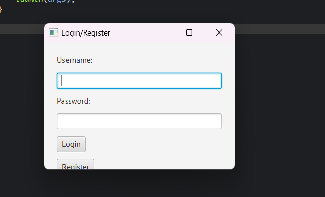
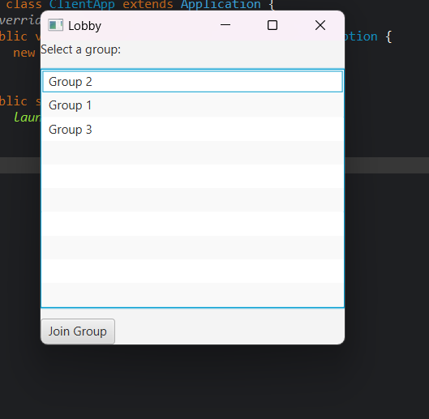
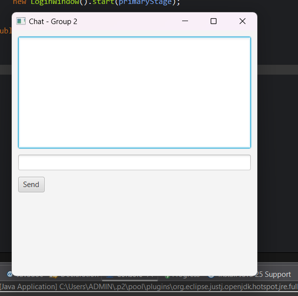

<h2 align="center">
    <a href="https://dainam.edu.vn/vi/khoa-cong-nghe-thong-tin">
    🎓 Faculty of Information Technology (DaiNam University)
    </a>
</h2>
<h2 align="center">
  Hệ thống Chat Nhóm bằng RMI +JavaFX
</h2>

    

        
        
        
    

1. 📖 Giới thiệu hệ thống

Hệ thống Chat Nhóm bằng RMI được xây dựng nhằm phục vụ nhu cầu trao đổi, thảo luận nhóm trong môi trường LAN/lab.
Mục tiêu là minh họa cách xây dựng ứng dụng phân tán bằng Java RMI, kết hợp giao diện JavaFX và quản lý dữ liệu người dùng bằng JSON Database.

Các chức năng chính

Người dùng:

📝 Đăng ký / Đăng nhập (lưu vào file users.json)

🏷️ Xem danh sách nhóm (Lobby với 3 phòng mặc định)

💬 Tham gia nhóm, gửi & nhận tin nhắn thời gian thực

📂 Gửi và tải file trực tiếp trong phòng chat

📜 Xem lại lịch sử chat trong session

Quản trị viên (demo):

👥 Quản lý user qua file users.json (có thể xoá, thêm user thủ công)

🗂️ Quản lý nhóm (3 nhóm mặc định, có thể mở rộng sau)

2. 🛠️ Ngôn ngữ & Công nghệ chính

☕ Java (JDK 8+ hoặc 11+)

🔗 Java RMI (Remote Method Invocation)

🎨 JavaFX — giao diện client

📄 JSON Database (file users.json) — quản lý user & nhóm đơn giản

💻 IDE: Eclipse / IntelliJ IDEA

🌐 Dev environment: Windows / Linux (LAN hoặc localhost)

Môi trường chạy (ví dụ):

JDK 8 hoặc 11

Port RMI mặc định: 1099

3. 🖼️ Hình ảnh các chức năng

🔑 Login / Register

🏠 Lobby (Sảnh chờ)

💬 Chat Window (Phòng chat)

4. 📝 Các bước cài đặt
<pre> Bước 1: Chuẩn bị môi trường - Cài JDK (8 hoặc 11). - Mở terminal/command prompt, kiểm tra: java -version javac -version → Đảm bảo Java đã cài thành công. - Chuẩn bị IDE: Eclipse IDE hoặc IntelliJ IDEA. - Workspace chọn thư mục project RMI Chat. </pre>
<pre> Bước 2: Tạo Project và Cấu trúc - Tạo Java Project mới trong Eclipse: File → New → Java Project Project name: RMIChatGroup JRE: chọn JDK 8/11 Bỏ chọn "Create module-info.java" → Finish - Tạo các package chính và copy source code vào: (ChatRMIProject/src/common, server, client, client.fx, database, resources) </pre>
<pre> Bước 3: Thêm mã nguồn - Copy toàn bộ source code vào đúng package/file tương ứng. - Ctrl + Shift + O (Eclipse) để organize imports. - Đảm bảo không có lỗi compile trong Project Explorer. </pre>
<pre> Bước 4: Chạy ứng dụng 1. Khởi động Server: - Mở file ChatServerMain.java trong package server. - Run As → Java Application - Console hiển thị: RMI Chat Server started... Đang chờ client kết nối... 2. Khởi động Client: - Mở file MainApp.java trong package client.fx - Run As → Java Application - Giao diện đăng nhập xuất hiện. 3. Sau khi đăng nhập thành công: - WelcomeUI hiển thị thông điệp chào mừng. - Chuyển đến Lobby (chọn phòng chat). - Vào ChatRoom để trao đổi tin nhắn nhóm, gửi file. → Console server sẽ log: "Client đã kết nối: /127.0.0.1" </pre>
5. 👤 Thông tin liên hệ
<pre> Sinh viên thực hiện: Trịnh Hữu Hiệu Khoa Công nghệ Thông tin – Đại học Đại Nam 🌐 Website: https://dainam.edu.vn/vi/khoa-cong-nghe-thong-tin 📧 Email: trinhhuuhieu19122003@gmail.com 📱 Fanpage: AIoTLab - FIT DNU </pre>